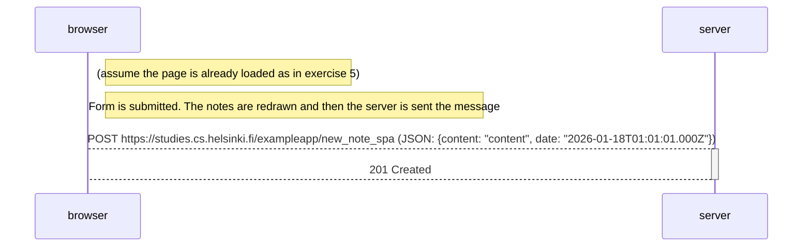

```mermaid
sequenceDiagram
    participant browser
    participant server

    Note right of browser: (assume the page is already loaded as in exercise 5)
    Note right of browser: Form is submitted. The notes are redrawn and then the server is sent the message
    browser-->server: POST https://studies.cs.helsinki.fi/exampleapp/new_note_spa (JSON: {content: "content", date: "2026-01-18T01:01:01.000Z"})
    activate server
    server-->browser: 201 Created
    deactivate server
```

